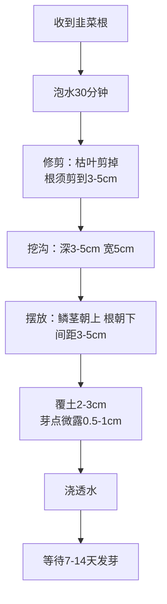
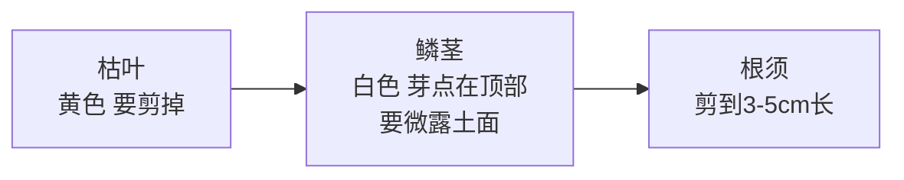

# 阳台藤本植物种植方案

## 一、阳台基本条件

| 项目 | 数值 |
|------|------|
| 城市 | 深圳 |
| 朝向 | 东北 |
| 尺寸 | 0.8m（进深）× 2m（长度） |
| 种植区 | 最左侧 0.45m × 0.8m |
| 晾衣架 | 1.2m（中间） |
| 空余区 | 0.35m（右侧，过人用） |
| 光照 | 上午斜射光，半阴环境 |
| 阳台结构 | 底部70-80cm实心墙，上方铁条栏杆 |

> ⚠️ 由于有70-80cm实心墙，太阳斜照时**靠栏杆墙根处光照最少，靠内墙处光照最多**。

---

## 二、种植布局

### 阳台俯视图

```
                栏杆（外侧，沿2m长边）
  ┌──────────────────────────────────┐
  │  ┌────────┐                      │
  │  │ 盆1     │ 常春藤（爬铁条）     │
  │  │44×18.8  │                      │
  │  └────────┘                      │
  │  ┌────────┐                      │
  │  │ 盆2     │ 留兰香薄荷           │
  │  │44×18.8  │                      │
  │  └────────┘                      │
  │  ┌────────┐                      │
  │  │ 盆3     │ 紫根细叶韭菜         │
  │  │44×18.8  │                      │
  │  └────────┘                      │
  │  ┌────────┐                      │
  │  │ 盆4     │ 木耳菜（插支架）     │
  │  │44×18.8  │                      │
  │  └────────┘                      │
  └──────────────────────────────────┘
                墙（室内侧，沿2m长边）
  ←─────────── 0.8m进深 ───────────→
  ←── 0.45m ──→
```

### 植物排列（从外到内）

| 盆 | 位置 | 植物 | 光照需求 | 种植方式 |
|----|------|------|---------|---------|
| 盆1 | 最靠栏杆 | 常春藤 | 极耐阴 | 买苗 |
| 盆2 | 第二排 | 留兰香薄荷 | 耐阴 | 播种 |
| 盆3 | 第三排 | 紫根细叶韭菜 | 耐半阴 | 买韭菜根 |
| 盆4 | 最靠墙（光照最好） | 木耳菜 | 需较多光照 | 播种 |

**排列逻辑**：
- 常春藤放最外侧：极耐阴，可爬栏杆铁条
- 薄荷、韭菜耐阴，放中间
- 木耳菜需较多光照，放最内侧

---

## 三、四种植物详解

### 1. 常春藤（盆1）

| 项目 | 说明 |
|------|------|
| 类型 | 观赏藤本，四季常绿 |
| 实用价值 | 遮阴、净化空气、爬栏杆美观 |
| 光照 | 极耐阴，半阴环境完美适配 |
| 种植方式 | 买盆栽苗（1-2株） |
| 浇水 | 见干见湿，土干2cm再浇 |
| 施肥 | 缓释肥1-2个月1次 |
| 修剪 | 定期修剪造型，防止藤蔓乱爬 |
| 控高 | 高度控制在1.2m以下，不超过晾衣杆 |

**种植步骤**：
1. 从原盆带土坨取出（不要弄散土）
2. 挖和土坨大小相当的坑
3. 放入，周围填土压实
4. 浇透水
5. 阴凉处缓苗2-3天
6. 引导藤蔓爬栏杆铁条，用扎带固定

---

### 2. 留兰香薄荷（盆2）

| 项目 | 说明 |
|------|------|
| 类型 | 香草，多年生宿根 |
| 实用价值 | 泡茶、驱蚊、调味 |
| 光照 | 耐阴，半阴环境可种 |
| 种植方式 | 播种（每盆撒15-20粒，留3-5株） |
| 浇水 | 土干即浇，怕旱 |
| 施肥 | 缓释肥2-3周1次（或营养液） |
| 采收 | 摘嫩叶泡茶，越摘越旺 |
| 控根 | 独立盆天然控根，不会窜到其他盆 |

**播种步骤**：
1. 土表平整，浇透水
2. 种子撒在土表（约15-20粒）
3. **不要覆土**（需见光发芽）
4. 轻轻按压贴合土面
5. 喷壶喷湿
6. 盖保鲜膜保湿（戳几个小孔）
7. 7-14天出芽，揭膜
8. 长2-3片真叶后间苗，留3-5株

> ⚠️ 薄荷种子必须用喷壶喷水，不要浇水，会冲跑种子。

---

### 3. 紫根细叶韭菜（盆3）

| 项目 | 说明 |
|------|------|
| 类型 | 多年生宿根蔬菜 |
| 实用价值 | 调味、包饺子、炒鸡蛋 |
| 光照 | 耐半阴 |
| 种植方式 | 买韭菜根（20-30棵，种8-12棵/盆） |
| 浇水 | 见干见湿，耐旱 |
| 施肥 | 每次割后施缓释肥 |
| 采收 | 长到20cm高就割，留茬3-5cm |
| 特点 | 多年生，种一次年年割 |

**种植步骤流程图**：



**韭菜根结构图**：



**摆放侧视图（关键！）**：

```
    土面  ─────────────────────
            ↑          ↑
          0.5-1cm    鳞茎微露
            ↓          ↓
         ┌───┐     ┌───┐
         │茎 │     │茎 │    ← 鳞茎朝上
         └─┬─┘     └─┬─┘
           │         │
          根         根       ← 根朝下
    ──────────────────────────
            沟底（3-5cm深）
```

> ⚠️ **芽点要微露土面**，不要全埋住，否则会闷死。

**每步操作详解**：

| 步骤 | 操作 | 要点 |
|------|------|------|
| 1. 泡水 | 清水泡30分钟 | 让根吸饱水 |
| 2. 修剪 | 剪枯叶、根剪到3-5cm | 去掉腐烂部分 |
| 3. 挖沟 | 深3-5cm，宽5cm | 用小铲子挖 |
| 4. 摆放 | 鳞茎朝上、根朝下 | 间距3-5cm，种8-12棵 |
| 5. 覆土 | 盖2-3cm土 | 芽点微露0.5-1cm |
| 6. 浇水 | 浇到盆底储水层有水 | 一次浇透 |
| 7. 等待 | 7-14天 | 土保持湿润 |

**关键要点速查**：

| 要点 | 数值 |
|------|------|
| 泡水时间 | 30分钟 |
| 根留长 | 3-5cm |
| 沟深 | 3-5cm |
| 株距 | 3-5cm |
| 覆土厚度 | 2-3cm |
| 芽点露出 | 0.5-1cm |
| 发芽时间 | 7-14天 |

---

### 4. 木耳菜（盆4）

| 项目 | 说明 |
|------|------|
| 类型 | 一年生藤本蔬菜 |
| 实用价值 | 嫩叶嫩梢炒食/凉拌 |
| 光照 | 需较多光照，放最内侧 |
| 种植方式 | 播种（每盆撒3-4粒，留1株） |
| 浇水 | 喜湿，土干即浇 |
| 施肥 | 缓释肥7-10天1次（或营养液） |
| 采收 | 掐嫩梢，越掐分枝越多 |
| 支架 | 插90cm支架，引导攀爬 |

**播种步骤**：
1. 种子温水泡6-12小时
2. 挖3-4个小坑（深1cm，分散放）
3. 每坑放1粒种子
4. 覆土1cm，喷湿
5. 盖保鲜膜保湿
6. 3-7天出芽，揭膜
7. 长2-3片真叶后间苗，留最强1株

> ⚠️ 间苗用剪刀贴地剪，不要用手拔（会伤留下的苗的根）。

---

## 四、采购清单

### 种植容器

| 物品 | 规格 | 数量 | 参考价 |
|------|------|------|--------|
| 自吸水种植盆 | 44×18.8×20cm | 4个 | 10-15元/个 |

### 土壤与肥料

| 物品 | 规格 | 数量 | 参考价 |
|------|------|------|--------|
| 营养土 | 30L/袋 | 2袋 | 15-20元/袋 |
| 缓释肥 | 250g/瓶（奥绿1号或美乐棵通用型） | 1瓶 | 15-30元 |
| 通用营养液 | 可选 | 1瓶 | 10-20元 |

### 植物

| 物品 | 规格 | 数量 | 参考价 |
|------|------|------|--------|
| 常春藤苗 | 盆栽苗（青叶） | 1-2株 | 7-15元 |
| 留兰香薄荷种子 | 包装 | 1包 | 3-5元 |
| 紫根细叶韭菜根 | 20-30棵 | 1份 | 5-10元 |
| 木耳菜种子 | 包装 | 1包 | 3-5元 |

### 工具

| 物品 | 规格 | 数量 | 参考价 |
|------|------|------|--------|
| 小铲子/耙子 | 迷你三件套 | 1套 | 10-15元 |
| 喷壶 | 细雾型1-2L | 1个 | 8-15元 |
| 种植支架 | 90cm | 1个 | 5-10元 |
| 园艺扎带 | 1包 | 1包 | 3-5元 |
| 剪刀 | 厨房剪刀即可 | 用家里的 | - |

**总预算：约 150-200 元**

---

## 五、装土方法

### 每盆用量

| 材料 | 每盆 | 4盆合计 |
|------|------|---------|
| 营养土 | 约10L | 约40L |
| 缓释肥 | 15-20g（一小把） | 60-80g |

### 装土步骤

1. **检查吸水隔板**：自吸水盆底部有储水层和吸水隔板，确认装好
2. **拌土**：营养土倒出来，加一把缓释肥，拌匀
3. **装盆**：填到离盆口2cm
4. **浇透水**：浇到盆底储水层有水

> ⚠️ 自吸水盆底部自带储水层，**不用铺陶粒**。

---

## 六、种植流程

### 购买顺序

**第一批**（提前买）：种植盆、营养土、缓释肥、工具、支架、种子
**第二批**（第一批到了再买）：常春藤苗、韭菜根

> 苗和根收到后1-2天内必须种，不能久放。

### 种植当天步骤

1. 所有盆装好土，浇透水
2. 盆1种常春藤（带土坨种）
3. 盆3种韭菜根（泡水后种）
4. 盆4播木耳菜种子（覆土1cm）
5. 盆2播薄荷种子（不覆土）
6. 盆4插90cm支架

### 缓苗期（第一周）

- 常春藤、韭菜：散光处缓苗2-3天
- 木耳菜、薄荷：盖保鲜膜保湿，散光处
- 不施肥
- 土干了喷点水

---

## 七、日常养护

### 浇水（自吸水盆）

看盆底储水层水位，空了就加水：

| 季节 | 频率 |
|------|------|
| 春秋（10-11月、3-4月） | 1-2周1次 |
| 冬季（12-2月） | 2-3周1次 |
| 夏季（5-9月） | 2-5天1次 |

> 夏季建议配自动滴水器，防止忘记浇水。

### 施肥（两种搞定所有植物）

| 肥料 | 用法 | 频率 |
|------|------|------|
| 缓释肥 | 撒土表/混土 | 装土时+每3个月1次 |
| 通用营养液 | 兑水浇 | 每2周1次（可选） |

> 懒人版：只用缓释肥就行，营养液可省略。

### 修剪与采收

| 植物 | 操作 |
|------|------|
| 常春藤 | 定期修剪造型，高度控制在1.2m以下 |
| 薄荷 | 摘嫩叶，越摘越旺 |
| 韭菜 | 长到20cm割，留茬3-5cm |
| 木耳菜 | 掐嫩梢，留2-3片叶 |

---

## 八、病虫害防治

东北半阴阳台病虫害较少，以预防为主：

| 问题 | 症状 | 解决方法 |
|------|------|---------|
| 蚜虫 | 叶背有小绿虫 | 稀释洗洁精水（1:500）喷 |
| 白粉病 | 叶面白粉 | 通风，小苏打水（1g:500ml）喷 |
| 烂根 | 叶子蔫、土臭 | 减少浇水，检查排水 |

**预防要点**：
- 通风：盆之间留间隙
- 清洁：及时摘黄叶
- 薄肥勤施：不要浓肥

---

## 九、时间线

| 时间 | 里程碑 |
|------|--------|
| Day 1 | 装土、种植、播种 |
| Day 3-7 | 木耳菜出芽 |
| Day 7-14 | 薄荷出芽、韭菜发芽 |
| Day 14 | 间苗、插支架 |
| Day 30 | 木耳菜可掐嫩梢 |
| Day 45-60 | 薄荷可摘叶泡茶 |
| Day 60 | 韭菜可割第一茬 |
| 3个月后 | 撒第二次缓释肥 |

---

## 十、注意事项

1. **光照**：木耳菜放最内侧（光照最好），常春藤放最外侧（耐阴爬栏杆）
2. **控高**：藤蔓控制在1.2m以下，不影响晾衣架
3. **薄荷控根**：独立盆种植，天然控根
4. **施肥**：宁少勿多，薄肥勤施
5. **浇水**：看储水层，不要积水
6. **缓苗**：新种的植物先放散光处，不要急着晒太阳
